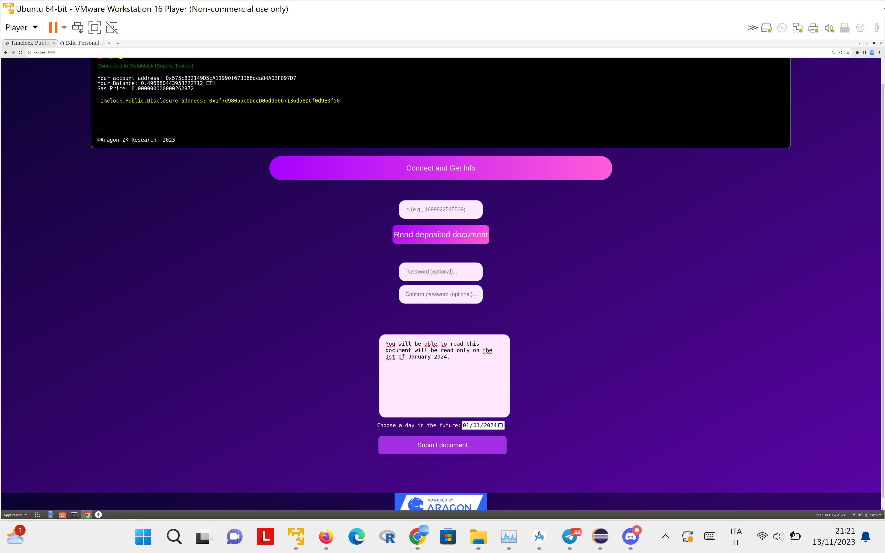

# Timelock.Public.Disclosure
This repo contains an example of a web3 App that can use the [timelock.zone](https://www.timelock.zone) service to deposit timelock encrypted documents over Ethereum with a GAS cost of only 67k. The trick to keep the GAS cost so low is to deposit on-chain only a shortned URL encoding the actual ciphertext. The shortner service is trusted only for keeping the hash alive but not for confidentiality.
The document can be timelocked until a chosen date and additionally a password can be used to restrict the visibility.

Timelock.zone is a public service built on [drand](https://drand.love) that publishes public keys for future timeframes whose corresponding secret keys will be released at the correpsonding time. See also [tlcs-c](https://github.com/aragonzkresearch/tlcs-c/), [tlcs-rust](https://github.com/aragonzkresearch/tlcs-rust/), [timelock.fs](https://github.com/vincenzoiovino/timelock.fs), [timelock.android.example](https://github.com/vincenzoiovino/Timelock.zone.AndroidExample/tree/master), and [TLCS Usage](https://github.com/aragonzkresearch/tlcs-c/blob/main/examples/howtoencrypt.md).

## Compilation and setup
We will use the [ecies-wasm](https://github.com/ecies/rs-wasm) package.
We suppose that the library has been compiled under the folder ``pkg``. To ease your task, the repo already incluses a precompiled version of the aforementioned ``wasm`` library.

Download the file `timelock.lib.js` from  [here](https://github.com/vincenzoiovino/TimeLockJavaScriptAPI/blob/main/src/timelock.zone.lib.js) and copy it into the main folder. A (possibly non-updated version) of the latter file is also provided in this repository in the same folder.

Run a webserver in your local machine and open the link ``index.html`` in your favourite browser.

### Server-side
The demo in this repo assumes that there is another webserver ``https://localhost:81`` (you can change the URL in the variable ``API_URL``) that when invoked on a path like ``https://localhost:81/public.disclosure/s`` where ``s`` is an arbitrary ASCII string just responds ``ok``. This is a needed for the short URL service.

You can run this service with the command:
```bash
node server-side/public.disclosure.service.js
```
The service depends on the ``node.js`` modules `express`, `cors` and `nocache`.
As you can inspect from the code the server is quite trivial and equivalently you can replace it with your favourite web server serving the same path on the same port.

## Usage
First, connect the App to your wallet.
### Deposit a document
Write a document, choose a date in the future and click on ``Submit document``, you will be asked to sign a transaction. Once you did wait for confirmation, you will receive an identifier (a decimal number).
### Read a deposited document
Input the identifier, and click on ``Read deposited document``. If the date specified at encryption time is past you will be able to read the document, otherwise you will be asked to wait until the given date.

### Optional password
You also have the option of choosing a password when you submit a document. Do not forget to use the same password when you want to read the corresponding document.

## Screenshots


